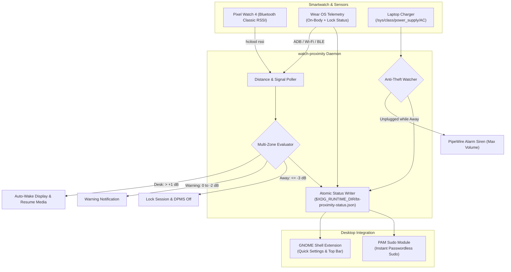

# watch-proximity

**watch-proximity** is an intelligent proximity screen locker, presence detector, and security guard for Linux (GNOME / Wayland) paired with a smartwatch (such as the Google Pixel Watch).

---

## Features

- **Multi-Zone RSSI Presence Engine**:
  - **Desk Zone (`> +1 dB`)**: Active working zone. Inhibit screen sleep, reset strikes, auto-resume media, and auto-wake display.
  - **Normal Zone (`+1 to 0 dB`)**: Safe zone within arm's reach of your desk.
  - **Warning Zone (`0 to -2 dB`)**: Gentle desktop notification alerting you that you are moving away before a lock occurs.
  - **Away Zone (`<= -3 dB` or Disconnected)**: Debounces consecutive away strikes (default: 5 strikes) before triggering session lock and powering off display backlight via DPMS.
- **Auto-Wake Display on Approach**:
  - While locked, the daemon continues sampling proximity.
  - As soon as your watch enters the **Desk Zone**, the display backlight powers on immediately (`PowerSaveMode = 0`) and idle time is reset, presenting the lock screen and fingerprint prompt before you even touch the keyboard.
- **Anti-Theft Charger Alarm**:
  - While locked and in the **Away** state, the daemon monitors the AC charger (`/sys/class/power_supply/AC/online`).
  - If the charger is unplugged while you are away, speaker volume is raised to 100% and a loud alarm siren loops via PipeWire (`pw-play`).
  - Disarms immediately when your watch walks back to the desk or the laptop is unlocked.
- **Wear OS On-Wrist & Lock Telemetry**:
  - Communicates directly with native Wear OS system sensors:
    - `dumpsys wear_service` -> `Last on body state detected: =OnBody`
    - `dumpsys trust` -> `deviceLocked=0` (PIN is unlocked)
- **GNOME Shell Quick Settings & Top-Bar Extension**:
  - Live top-bar status icon in the system panel.
  - Expandable `QuickMenuToggle` showing:
    - Real-time ASCII signal meter (`[████████░░] +5 dB`)
    - Dynamic zone and estimated distance
    - Watch security status (`Watch: Unlocked • On-Wrist`)
    - One-click snooze (15 minutes, 1 hour, Resume)
    - Toggles for *Auto-Wake* and *Anti-Theft Alarm*
- **Non-Blocking Architecture**:
  - Communicates via `$XDG_RUNTIME_DIR/bt-proximity-status.json` in tmpfs RAM. Zero subprocesses or shell lag in GNOME Shell.

---

## Architecture



---

## Repository Structure

```
watch-proximity/
├── flake.nix              # Flake entry point (packages, apps, homeManagerModules)
├── .gitignore
├── README.md
├── daemon/
│   └── watch-proximity.py # Main Python daemon
├── extension/
│   ├── metadata.json      # GNOME extension metadata (Shell 45-50)
│   └── extension.js       # GNOME QuickSettings toggle & panel indicator
└── nix/
    └── home-manager.nix   # Declarative Home Manager module
```

---

## Installation & Usage

### 1. Using with Nix Flakes & Home Manager

Add `watch-proximity` as a flake input in your system configuration:

```nix
# flake.nix
{
  inputs = {
    nixpkgs.url = "github:nixos/nixpkgs/nixos-unstable";
    watch-proximity.url = "path:/home/mambuco/Projects/watch-proximity";
  };

  outputs = { self, nixpkgs, watch-proximity, ... }: {
    # In your home-manager configuration:
    # imports = [ watch-proximity.homeManagerModules.default ];
  };
}
```

Then enable and configure it in your Home Manager module:

```nix
# home.nix
services.watch-proximity = {
  enable = true;
  deviceMac = "64:9D:38:1A:4F:5A";
  deviceName = "Pixel Watch 4";

  # Multi-Zone Thresholds (dB)
  deskThreshold = 1;       # > +1 dB is Desk
  warningThreshold = -2;   # 0 to -2 dB is Warning
  awayThreshold = -3;      # <= -3 dB is Away
  tolerance = 5;           # Strikes before locking

  autoWake = true;
  antiTheft = true;
  pauseMedia = true;
  resumeMedia = true;
};
```

### 2. Standalone / Development

Run directly with Nix:

```bash
# Enter dev shell
nix develop

# Run calibration mode to observe live RSSI & zones
watch-proximity --mac "64:9D:38:1A:4F:5A" --calibrate

# Run daemon directly
watch-proximity --mac "64:9D:38:1A:4F:5A" --verbose
```

---

## Configuration Reference

Configuration can be specified via `~/.config/watch-proximity.conf`:

```ini
# MAC address of your smartwatch
DEVICE_MAC="64:9D:38:1A:4F:5A"
DEVICE_NAME="Pixel Watch 4"

# Multi-Zone RSSI Thresholds (dB):
# Desk Zone (> +1 dB): Triggers auto-wake and media resume
DESK_THRESHOLD=1
# Warning Zone (0 to -2 dB): Triggers step-away warning notification
WARNING_THRESHOLD=-2
# Away Zone (<= -3 dB): Triggers lock after tolerance strikes
AWAY_THRESHOLD=-3

# Tolerance / Debounce Strikes
TOLERANCE_COUNT=5

# Polling Intervals (seconds)
POLL_INTERVAL=2.0
LOCKED_INTERVAL=2.5

# Automation Features
AUTO_WAKE=true
PAUSE_MEDIA=true
RESUME_MEDIA=true
ANTI_THEFT=true
```

---

## Interactive Calibration Mode

To test signal propagation, walls, and distance in your room:

```bash
watch-proximity -c
```

Output:
```
--- watch-proximity Calibration Mode ---
Target Device: 64:9D:38:1A:4F:5A
Zones: Desk (> 1 dB) | Normal (+1 to 0 dB) | Warning (0 to -2 dB) | Away (<= -3 dB)
Sampling every 2.0s. Walk away to observe readings.

[UNLOCKED] RSSI:  +7 dB  [██████████]  Dist: ~0.5m (Desk)     Zone: DESK (Auto-wake / Active)
[UNLOCKED] RSSI:  +1 dB  [██████████]  Dist: ~1.0m (Normal)   Zone: NORMAL (Safe)
[UNLOCKED] RSSI:  -1 dB  [█████████░]  Dist: ~2.0m (Warning)  Zone: WARNING (Step-away alert)
[UNLOCKED] RSSI:  -4 dB  [████████░░]  Dist: ~3.0m (Away)     Zone: AWAY (Lock trigger)
```

---

## License

MIT License. Designed with care for Linux and Wear OS.
